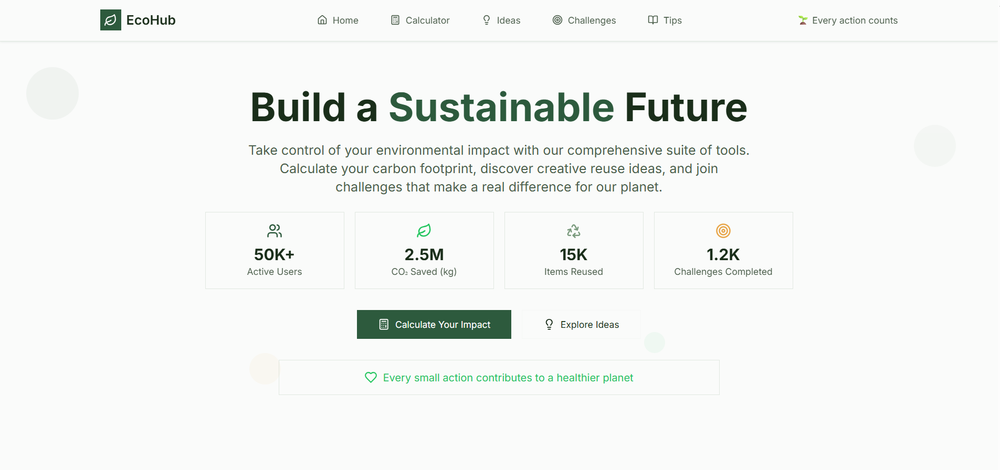

# 🌿 EcoHub

> **Live greener, one action at a time.**

EcoHub is a sustainability-focused web application designed to make eco-friendly living accessible and engaging for everyone. Whether you're a first-time recycler or a seasoned environmentalist, EcoHub gives you the tools, inspiration, and community to take meaningful action — from turning old plastic bottles into vertical gardens, to tracking your personal carbon footprint, to competing in weekly eco challenges with friends.

The app is built entirely on the frontend with React and Vite, making it fast, lightweight, and easy to deploy anywhere.

---

## 📸 Preview



---

## 🌟 Why EcoHub?

Most sustainability apps are either too complex or too preachy. EcoHub is neither — it's a practical, visual, and fun platform that meets people where they are. Key design goals:

- **No account required** to browse ideas or use the calculator
- **Mobile-first** responsive layout for on-the-go use
- **Beginner-friendly** content alongside advanced projects
- **Community-driven** with challenge leaderboards and social feeds

---

## ✨ Features

### 🏠 Home Dashboard
The central hub of the app. Displays real-time environmental statistics (CO₂ saved, items recycled, active users), highlights today's green tip, previews upcoming challenges, and provides quick navigation to all major sections via feature cards.

### ♻️ Reuse Ideas Gallery
A searchable, filterable gallery of DIY upcycling projects organized by material type (plastic, glass, fabric, electronics, paper, metal, wood). Each idea card shows:
- Difficulty level (beginner / intermediate / advanced) with color coding
- Time required and environmental impact rating
- Materials and tools needed
- Step-by-step instructions in a full-screen detail modal
- Bookmark functionality to save favorites

Filters include difficulty level, time commitment, and seasonal relevance. A floating "+" button lets users submit their own ideas.

### 🧮 Carbon Footprint Calculator
A guided, multi-step form that estimates a user's annual carbon emissions across three categories:
- **Transportation** — car, flights, public transit
- **Energy** — home electricity and heating usage
- **Lifestyle** — diet, shopping habits, waste

Results are shown in a visual breakdown panel with comparisons to national averages and personalized reduction tips.

### 🏆 Eco Challenges Hub
A gamified section where users can browse, join, and track sustainability challenges (e.g., "Go meat-free for 7 days", "Bike to work this week"). Features include:
- Active / completed / available challenge tabs
- Progress tracking with visual indicators
- Achievement badges for milestones
- A weekly leaderboard ranked by eco-points
- A social feed showing community activity

### 💡 Daily Green Tips
A curated feed of actionable eco tips updated daily, with:
- Category filtering (food, energy, transport, shopping, water, waste)
- A featured tip section at the top
- A personalization panel to tailor tips to your lifestyle
- A community tip submission form so users can contribute their own advice

---

## 🛠 Tech Stack

| Technology | Purpose |
|---|---|
| **React 18** | UI component library |
| **Vite** | Lightning-fast build tool and dev server |
| **Tailwind CSS** | Utility-first CSS framework |
| **React Router v6** | Client-side routing |
| **React Helmet** | Dynamic `<head>` management (page titles, meta tags) |
| **Lucide React** | Clean, consistent icon set |
| **PostCSS** | CSS transformation pipeline |

---

## 📁 Project Structure

```
src/
├── components/                   # Global shared components
│   ├── AppIcon.jsx                # Thin wrapper around Lucide icons
│   ├── AppImage.jsx               # Image with graceful fallback to placeholder
│   ├── ErrorBoundary.jsx          # Catches and displays runtime errors
│   ├── ScrollToTop.jsx            # Resets scroll position on route change
│   └── ui/                        # Base UI primitives used across all pages
│       ├── Button.jsx             # Primary / outline / ghost variants
│       ├── Checkbox.jsx           # Accessible checkbox with optional description
│       ├── Input.jsx              # Text input with consistent styling
│       ├── Select.jsx             # Dropdown select component
│       ├── NavigationBar.jsx      # Top nav with active link highlighting
│       └── MobileMenuDrawer.jsx   # Slide-in nav drawer for small screens
│
├── pages/                         # Each page lives in its own folder
│   ├── home-dashboard/
│   │   ├── components/
│   │   │   ├── HeroSection.jsx          # Headline, CTA, and animated stats
│   │   │   ├── FeatureCard.jsx          # Navigation cards to each section
│   │   │   ├── EnvironmentalStats.jsx   # Live impact numbers
│   │   │   ├── DailyTipPreview.jsx      # Snippet of today's tip
│   │   │   └── ChallengeHighlights.jsx  # Active challenge preview
│   │   └── index.jsx
│   │
│   ├── reuse-ideas-gallery/
│   │   ├── components/
│   │   │   ├── IdeaCard.jsx         # Card with image, tags, bookmark, and CTA
│   │   │   ├── IdeaDetailModal.jsx  # Full instructions in an overlay modal
│   │   │   ├── CategoryFilter.jsx   # Horizontal scrollable pill filters
│   │   │   ├── SearchBar.jsx        # Search input with filter toggle button
│   │   │   ├── FilterPanel.jsx      # Slide-in panel for advanced filters
│   │   │   └── AddIdeaFAB.jsx       # Floating action button (bottom-right)
│   │   └── index.jsx
│   │
│   ├── carbon-footprint-calculator/
│   │   ├── components/
│   │   │   ├── ProgressIndicator.jsx    # Step tracker (1 of 3, etc.)
│   │   │   ├── TransportationSection.jsx
│   │   │   ├── EnergySection.jsx
│   │   │   ├── LifestyleSection.jsx
│   │   │   └── ResultsPanel.jsx         # Visual breakdown of emissions
│   │   └── index.jsx
│   │
│   ├── eco-challenges-hub/
│   │   ├── components/
│   │   │   ├── ChallengeCard.jsx
│   │   │   ├── ChallengeProgressHeader.jsx
│   │   │   ├── ChallengeTabNavigation.jsx
│   │   │   ├── CategoryFilter.jsx
│   │   │   ├── LeaderboardSection.jsx
│   │   │   ├── AchievementBadges.jsx
│   │   │   └── SocialFeed.jsx
│   │   └── index.jsx
│   │
│   ├── daily-green-tips/
│   │   ├── components/
│   │   │   ├── FeaturedTip.jsx
│   │   │   ├── TipCard.jsx
│   │   │   ├── CategoryFilter.jsx
│   │   │   ├── PersonalizationPanel.jsx
│   │   │   └── TipSubmissionForm.jsx
│   │   └── index.jsx
│   │
│   └── NotFound.jsx               # 404 page
│
├── styles/
│   ├── index.css                  # Global CSS variables and custom utility classes
│   └── tailwind.css               # Tailwind @base / @components / @utilities
│
├── utils/
│   └── cn.js                      # Merges class names (clsx + tailwind-merge)
│
├── App.jsx                        # Route definitions (React Router)
└── index.jsx                      # ReactDOM.render entry point
```

---

## 🚀 Getting Started

### Prerequisites
- **Node.js** v18 or higher — [download here](https://nodejs.org)
- **npm** (comes with Node)

### Installation

```bash
# 1. Clone the repository
git clone https://github.com/your-username/ecohub.git
cd ecohub

# 2. Install dependencies
npm install

# 3. Start the development server
npm run dev
```

Open [http://localhost:5173](http://localhost:5173) in your browser. The page hot-reloads on every save.

### Other Useful Commands

```bash
npm run build      # Production build → output in /dist
npm run preview    # Preview the production build locally
```

---

## 🌍 Deployment

EcoHub is a pure static frontend — no server or database required. It can be hosted anywhere.

---

## 🤝 Contributing

Contributions are welcome! Here's how to get started:

1. Fork the repository
2. Create a feature branch: `git checkout -b feature/my-new-feature`
3. Commit your changes: `git commit -m "Add some feature"`
4. Push to the branch: `git push origin feature/my-new-feature`
5. Open a Pull Request

For major changes, please open an issue first to discuss what you'd like to change.

---


<p align="center">Made with lots of peace and thinking for the planet</p>
